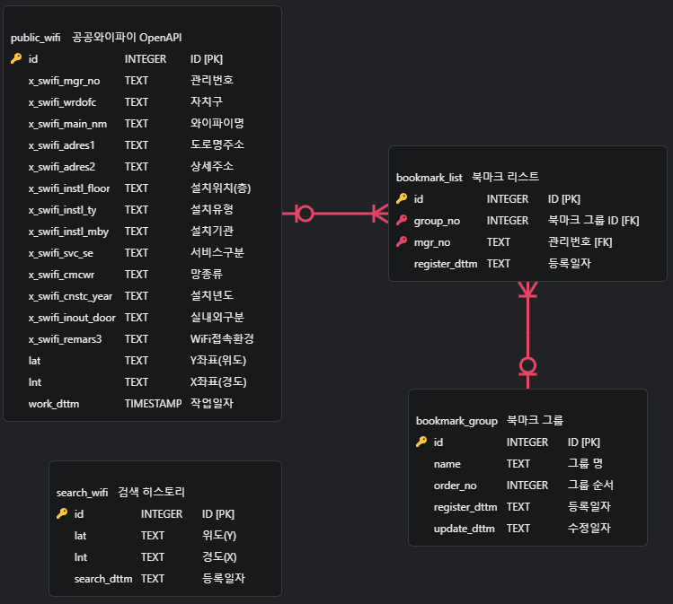

# Java_Web-Seoul_WiFi
- 내 위치 기반 공공 와이파이 정보(서울시 Open API)를 제공하는 JSP 웹서비스(WAS) 개발
- ZeroBase BackEnd School - Java/JSP Mission 1 Project

<div align=left>

## Tech Stack

### [ IDE & Tools ]

</a>
</a>

</a>
</a>

### [ Programming & Markup Language ]

</a>
</a>

</a>
</a>
</a>

### [ DataBase & App Server ]
</a>
</a>

</div>

## Project Settings 프로젝트 세팅 정보

### 1. Java & Maven
- `Java` : JDK 1.8
- `Maven` : Apache Maven 3.8.5

#### Maven Dependency
```
- javax.servlet : javax.servlet-api : 4.0.1
- javax.servlet.jsp : javax.servlet.jsp-api : 2.3.3
- com.squareup.okhttp3 : okhttp : 4.11.0
- com.google.code.gson : gson : 2.9.0
- org.lombok : lombok : 1.18.24
- org.xerial : sqlite-jdbc : 3.41.2.2
```

### 2. DB & API
- `DBMS` : SQLite 3.41.2.2
- `Seoul WiFi Open API` : 서울시 Open API (공공와이파이 위치정보)
  - [서울시 공공와이파이 서비스 위치 정보](https://data.seoul.go.kr/dataList/OA-20883/S/1/datasetView.do)

### 3. Web Application Server (WAS)
- `Apache Tomcat` : Apache Tomcat 9.0.97

# Project Outline 프로젝트 개요
- **프로젝트 목표**
  - 사용자 위치 기반으로 가까운 공공 WiFi 정보를 제공하고, 맞춤형 북마크 및 위치 기록 관리 기능을 제공하는 JSP 기반의 웹 애플리케이션 개발
- **구현 기능 목표**
  - Open API와 DBMS를 통한 데이터 수집, 관리, 조회 기능 구현
  - WiFi 정보 조회, 상세 정보 확인 기능 구현
  - 사용자 위치 기록 및 북마크 관리 기능 구현

## 주요 기능

### 1. **데이터베이스 관리**
- SQLite를 사용하여 데이터를 저장
- 데이터베이스 초기화 및 데이터 삽입 기능 포함
- 데이터베이스 트랜잭션을 통한 데이터 일관성 보장

### 2. **Open API 데이터 관리**
- 서울시 공공 WiFi Open API 데이터를 가져와 데이터베이스에 저장
- API 서버 오류 시 샘플 데이터를 활용한 기능 제공

### 3. **WiFi 정보 조회**
- 위도(LAT)와 경도(LNT)를 기반으로 가장 가까운 WiFi 정보 20개를 거리순으로 조회
- 사용자의 Geolocation(위치 정보) 가져오기 기능 지원

### 4. **WiFi 상세 정보**
- 특정 WiFi의 이름, 주소, 설치 정보, 네트워크 세부사항 등의 상세 정보 제공

### 5. **위치 기록 관리**
- 사용자가 조회한 위치 기록 저장 및 리스트 제공
- 개별 삭제 및 전체 삭제 기능 지원

### 6. **북마크 관리**
- 사용자 정의 북마크 그룹 생성 및 WiFi 북마크 추가 가능
- 북마크 그룹 수정 및 삭제 지원
- 중복 북마크 방지 기능 제공

# Project Structure 프로젝트 구조

## 1. 데이터베이스 구조 (ERD)

- **`public_wifi`**: WiFi 데이터 저장 테이블
- **`bookmark_group`**: 북마크 그룹 테이블
- **`bookmark_list`**: 북마크 데이터 테이블
- **`search_wifi`**: 위치 조회 기록 테이블

## 2. 프로젝트 폴더 구조

```
.
|-- java
|   |-- api
|   |   |-- APIService.java
|   |   |-- SampleDB.java
|   |   |-- ShowDetail.java
|   |   `-- WifiInfo.java
|   |-- bookmark
|   |   |-- Bookmark.java
|   |   |-- BookmarkDBTool.java
|   |   |-- BookmarkGroup.java
|   |   `-- BookmarkGroupDBTool.java
|   `-- dbtool
|       |-- History.java
|       |-- HistoryDBTool.java
|       |-- WifiLocation.java
|       `-- WifiLocationTool.java
|-- resources
`-- webapp
    |-- WEB-INF
    |   |-- db
    |   |   |-- sample.db
    |   |   `-- wifiDatabase.db
    |   `-- web.xml
    |-- css
    |   |-- popup.css
    |   |-- popup.css.map
    |   |-- popup.scss
    |   |-- style.css
    |   |-- style.css.map
    |   `-- style.scss
    |-- index.jsp
    |-- js
    |   `-- functions.js
    `-- jsp
        |-- bookmark
        |   |-- bookmark.jsp
        |   |-- bookmark_add_action.jsp
        |   |-- bookmark_delete.jsp
        |   |-- bookmark_delete_action.jsp
        |   `-- bookmark_delete_all.jsp
        |-- bookmark_group
        |   |-- bookmark_group.jsp
        |   |-- bookmark_group_add.jsp
        |   |-- bookmark_group_add_action.jsp
        |   |-- bookmark_group_delete.jsp
        |   |-- bookmark_group_delete_all.jsp
        |   |-- bookmark_group_edit.jsp
        |   `-- bookmark_group_edit_action.jsp
        |-- detailWifi.jsp
        |-- history
        |   |-- deleteHistory.jsp
        |   |-- delete_all_history.jsp
        |   `-- history.jsp
        `-- home
            |-- home.jsp
            `-- loadOpenAPI.jsp

15 directories, 41 files
```

## 3. 프로그램 결과물 (웹 화면 캡쳐)
### 메인 페이지
- WiFi 검색 폼과 Open API 데이터 로드 버튼 제공
- 입력한 위치 기준으로 가까운 WiFi 정보 20개 리스트 제공
### 상세 정보 페이지 (팝업)
- 특정 WiFi 상세 정보 제공
- 북마크 추가 기능 제공
### 위치 기록 페이지
- 사용자 위치 조회 기록 확인 및 삭제
### 북마크 관리 페이지
- WiFi 북마크 조회/삭제 기능
### 북마크 그룹 관리 페이지
- 북마크 그룹 조회/생성/수정/삭제(CRUD) 기능

# 개발자 정보
- 개발자 : 정경재 (KyungJae, Cheong)
- 이메일 : dankool@naver.com
- 깃허브 : https://github.com/kyungjaecheong
